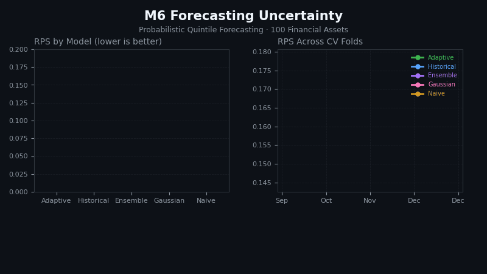

# M6 Forecasting Uncertainty

[](https://github.com/RickArko/M6/actions/workflows/ci.yml)
[](https://www.python.org/)
[](https://github.com/astral-sh/ruff)
[](https://docs.astral.sh/uv/)
[](LICENSE)
[](https://www.unic.ac.cy/iff/research/forecasting/m-competitions/m6/)

Reproducible solution for the [M6 Forecasting Competition](https://www.unic.ac.cy/iff/research/forecasting/m-competitions/m6/),
focused on **probabilistic (quintile) forecasting** for 100 financial assets using the
**Ranked Probability Score (RPS)**.



> Regenerate with `make viz` (after `make score`) — draws RPS bar chart + per-fold line chart
> from `reports/metrics/headline.csv` and `reports/metrics/per_fold.parquet`.

The M6 competition differed from earlier M competitions by asking for **relative rankings**
across assets rather than point forecasts of individual time series. Participants predicted
which quintile (1 = worst, 5 = best) each of 100 assets would fall into over the next 4 weeks.

---

## Stack

| Layer | Choice |
|-------|--------|
| Language | Python ≥ 3.12 |
| Package manager | [uv](https://docs.astral.sh/uv/) |
| Financial data | [yfinance](https://github.com/ranaroussi/yfinance) |
| Numerics | numpy, pandas, scipy, scikit-learn |
| CLI | [Typer](https://typer.tiangolo.com/) |
| Logging | [Loguru](https://loguru.readthedocs.io/) |
| Plotting | matplotlib, seaborn |
| Testing | pytest, pytest-cov |
| Linting | Ruff |
| Types | mypy |

---

## Quick Start (5 minutes)

```bash
# Prerequisites: bash, make, git, curl

# 1. Clone
git clone https://github.com/your-org/m6
cd m6

# 2. Bootstrap (installs uv, syncs all deps)
make bootstrap

# 3. Verify
make check

# 4. Download 100 M6 assets from Yahoo Finance
make download

# 5. Build training frame
make prep

# 6. Run naive benchmark CV
make cv-naive          # RPS ≈ 0.16

# 7. Run historical and Gaussian CV
make cv-historical
make cv-gaussian

# 8. Score everything
make score
```

---

## Makefile Targets

### Setup
| Target | Description |
|--------|-------------|
| `bootstrap` | First-time setup (installs uv, syncs deps) |
| `install` | Sync deps, install pre-commit hooks |

### Quality
| Target | Description |
|--------|-------------|
| `lint` | Ruff lint |
| `fmt` | Ruff format + fix |
| `typecheck` | mypy on `src/m6/` |
| `test` | Full pytest suite |
| `test-smoke` | Smoke tests (~1s) |
| `test-unit` | Unit tests |
| `test-integration` | Integration tests |
| `test-fast` | Smoke + unit (no coverage) |
| `cov` | Test suite with coverage |
| `check` | Lint + types + tests (CI entry point) |

### Pipeline
| Target | Description |
|--------|-------------|
| `download` | Download M6 price data from Yahoo Finance |
| `prep` | Build long-format training parquet |
| `cv-naive` | CV for naive equal-probability benchmark |
| `cv-historical` | CV for historical frequency model |
| `cv-gaussian` | CV for multivariate Gaussian model |
| `cv-recipe` | CV from YAML recipe |
| `score` | Score CV artifacts → reports |
| `score-all` | Score every CV artifact found |

### Utilities
| Target | Description |
|--------|-------------|
| `clean` | Remove build artifacts |
| `clean-all` | Remove .venv, data, forecasts, artifacts |
| `notebook` | Launch Jupyter Lab |

---

## CLI Reference

All Make targets above wrap the `m6` CLI:

```bash
# Download data
m6 download

# Build the long frame
m6 prep

# Cross-validate a model
m6 cv naive --horizon 20 --n-windows 6
m6 cv historical --horizon 20 --n-windows 6
m6 cv gaussian --horizon 20 --n-windows 6

# Score all CV outputs
m6 score --model naive --model historical --model gaussian

# Forecast forward
m6 forecast gaussian --horizon 20
```

---

## Project Layout

```
m6/
├── Makefile                  # Canonical entrypoint
├── pyproject.toml            # Dependencies + tooling config
├── README.md
├── AGENTS.md                 # AI coding agent context
├── configs/m6/               # YAML recipes
│   ├── naive.yaml
│   ├── historical.yaml
│   └── gaussian.yaml
├── src/m6/                   # Main package
│   ├── cli.py                # Typer CLI
│   ├── config.py             # Settings + paths
│   ├── data.py               # Data loading (yfinance) + long frame
│   ├── evaluation.py         # RPS computation
│   ├── metrics.py            # Accuracy, log-loss, Brier
│   ├── scoring.py            # Multi-axis scoring
│   ├── features.py           # Financial feature engineering
│   ├── cv.py                 # Rolling-origin cross-validation
│   ├── models/
│   │   ├── naive.py          # Equal-probability benchmark
│   │   ├── historical.py     # Historical frequency model
│   │   └── gaussian.py       # Multivariate normal + MC model
│   └── viz/                  # Visualisation (WIP)
├── tests/
│   ├── conftest.py           # Shared fixtures
│   ├── smoke/                # Package sanity checks
│   ├── unit/                 # Pure-function tests
│   └── integration/          # End-to-end on toy data
└── notebooks/                # Jupyter notebooks (WIP)
```

---

## Configuration

Environment variables (`.env` file or prefix commands):

| Variable | Default | Description |
|----------|---------|-------------|
| `M6_SEED` | `42` | Global random seed |
| `M6_HORIZON` | `20` | Forecast horizon (trading days) |
| `M6_N_WINDOWS` | `6` | CV windows |
| `M6_N_ASSETS` | `-1` | Asset subsample (-1 = all) |
| `M6_START_DATE` | `2015-01-01` | Data start |
| `M6_END_DATE` | `2023-02-28` | Data end |
| `M6_COV_SHRINKAGE` | `0.3` | Covariance shrinkage (Gaussian model) |
| `M6_N_MC` | `100000` | Monte Carlo simulations |
| `LOG_LEVEL` | `INFO` | Logging level |

---

## The M6 Competition

- **100 assets**: 50 US stocks + 50 international ETFs
- **Forecast horizon**: 4 weeks (~20 trading days)
- **Format**: Predict probability of landing in each of 5 quintiles
- **Metric**: Ranked Probability Score (RPS)
- **Naive benchmark**: Equal probability 0.2 → RPS = 0.16
- **Top-3 solutions**: RPS ≈ 0.15645–0.15649

Only 38 of 163 teams (23%) beat the naive benchmark overall.

### Key Findings
1. Forecasting financial returns is extremely difficult — most teams couldn't beat the dart-throwing monkey
2. Simple methods (random walk, adaptive volatility) performed competitively with complex deep learning
3. The cross-sectional relative ranking task is fundamentally different from traditional time-series forecasting

### Published Benchmarks
| Method | RPS |
|--------|-----|
| Naive equal-probability | 0.16000 |
| Dan (1st) | 0.15645 |
| FinQBoost (2nd) | 0.15648 |
| SebastianR (3rd) | 0.15649 |

---

## License

MIT
